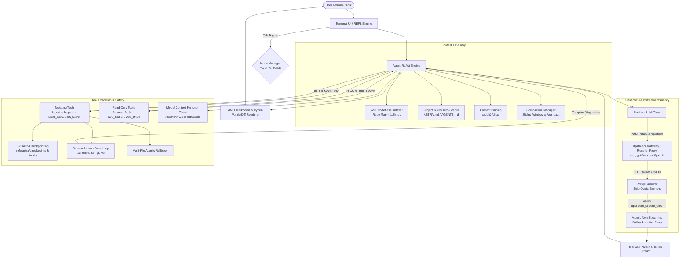

# ARCHITECTURE DESIGN: ASTRA-CLI
> Autonomous Terminal Agent Engine — Technical Specification & Module Contracts

---

## 1. HIGH-LEVEL SYSTEM TOPOLOGY



---

## 2. DIRECTORY STRUCTURE

```text
astra-cli/
├── bin/
│   └── astra.js                 # Executable CLI entrypoint (npx astra / astra-cli)
├── src/
│   ├── config.js                # Configuration, .env, CLI args, ~/.astra/config.json
│   ├── client.js                # Resilient OpenAI SSE client, stream error recovery
│   ├── engine.js                # Autonomous ReAct agent loop & state machine
│   ├── repomap.js               # AST codebase skeleton generator (<1.500 tokens)
│   ├── git.js                   # Shadow git checkpointing & instant /undo rollback
│   ├── diff.js                  # ANSI unified diff computer & terminal renderer
│   ├── session.js               # Session persistence & resume (~/.astra/sessions/)
│   ├── mcp.js                   # Model Context Protocol (MCP) client manager
│   ├── tools/
│   │   ├── index.js             # Tool registry, JSON Schema, and mode gates
│   │   ├── fs.js                # 4-Tier resilient patch, read, write, list
│   │   ├── bash.js              # Sandboxed cross-platform / Termux shell execution
│   │   ├── proc.js              # Background process supervisor (proc_spawn, proc_kill)
│   │   └── web.js               # Web search (DuckDuckGo) & fetch (Markdown converter)
│   └── ui/
│       ├── ansi.js              # Astra Cyber-Purple color theme & badge widgets
│       ├── repl.js              # Raw mode stdin reader, Tab switch, bracketed paste
│       ├── stopwatch.js         # Live latency timer & Time-To-First-Token (TTFT) counter
│       └── telemetry.js         # Token usage tracking & estimated API cost counter
├── package.json
└── README.md
```

---

## 3. CORE MODULE CONTRACTS & INTERFACES

### 3.1 Resilient LLM Client (`src/client.js`)
- **Tujuan**: Menangani komunikasi HTTP/SSE dengan proxy reseller (`gpt-6-astra`, OpenAI, OpenRouter) tanpa pernah crash akibat pemutusan socket sepihak.
- **Contract**:
  ```typescript
  interface ClientConfig {
    baseUrl: string;
    apiKey: string;
    model: string;
    timeoutMs?: number;
  }

  interface ChatResponse {
    role: "assistant";
    content: string | null;
    tool_calls?: Array<{
      id: string;
      type: "function";
      function: { name: string; arguments: string };
    }> | null;
  }

  function chatCompletion(
    messages: Message[],
    tools: ToolDefinition[],
    onDelta?: (token: string) => void
  ): Promise<ChatResponse>;
  ```
- **Error Recovery Algorithm**:
  1. Mulai transmisi dengan `stream: true`.
  2. Parse baris demi baris `data: {...}`.
  3. Jalankan regex sanitizer: `text.replace(/🔔\s*Peringatan:[^\n\r]+/gi, "")`.
  4. Jika terdeteksi string `upstream_stream_error` atau event socket close prematur:
     - Discard buffer parsial yang korup.
     - Jitter sleep: `1200ms - 2000ms`.
     - Request ulang turn tersebut via mode non-streaming atomik (`stream: false`).

---

### 3.2 File System Engine & 4-Tier Patching (`src/tools/fs.js`)
- **Tujuan**: Memastikan kode dari LLM selalu berhasil di-merge ke file lokal Windows, Unix, maupun Android Termux tanpa rusak akibat inkonsistensi CRLF/LF atau spasi.
- **Contract**:
  ```typescript
  function patchFile(path: string, oldStr: string, newStr: string): Promise<string>;
  function writeFile(path: string, content: string): Promise<string>;
  function readFile(path: string, startLine?: number, endLine?: number): Promise<string>;
  function listDirectory(path?: string): Promise<string>;
  ```
- **Patch Resolution Pipeline**:
  - **Tier 1 (Exact)**: `content.includes(oldStr)`.
  - **Tier 2 (CRLF/LF Normalize)**: Normalisasi `\r\n` ke `\n` pada kedua sisi, lakukan replace, lalu kembalikan line-ending sesuai file asal.
  - **Tier 3 (Fuzzy Indent Line Matcher)**: Trim whitespace per baris dan cocokkan urutan baris logika.
  - **Tier 4 (Self-Healing Signal)**: Throw exception terstruktur `"Patch failed: Target block not found in file. Action required: Call fs_write with the entire updated file content."` agar ReAct loop otomatis mengoreksi tanpa crash.

---

### 3.3 Platform Abstraction & Android Termux Layer (`src/tools/bash.js`)
- **Tujuan**: Eksekusi sub-proses di PowerShell (Windows), Bash/Zsh (Linux/macOS), dan Termux (Android).
- **Resolver**:
  ```javascript
  import os from "node:os";

  export function resolveShell() {
    if (os.platform() === "win32") {
      return { shell: "powershell.exe", args: ["-NoProfile", "-Command"] };
    }
    // Termux Android Detection
    if (process.env.PREFIX && process.env.PREFIX.includes("com.termux")) {
      const termuxBash = `${process.env.PREFIX}/bin/bash`;
      return { shell: termuxBash, args: ["-c"] };
    }
    // Standard Unix / macOS
    const unixShell = process.env.SHELL || "/bin/sh";
    return { shell: unixShell, args: ["-c"] };
  }
  ```

---

### 3.4 AST Codebase Skeleton Indexer (`src/repomap.js`)
- **Tujuan**: Memberikan pemahaman arsitektur seluruh proyek ke prompt model dengan budget < 1.500 token.
- **Mekanisme**:
  - Mengabaikan folder `.git`, `node_modules`, `dist`, `.cache`, serta file yang terdaftar di `.astraignore`.
  - Ekstraksi simbol berbasis regex/WASM (`export function`, `class`, `interface`, `type`, `def`, `func`, `pub fn`).
  - Output diinjeksi ke System Prompt setiap awal turn.

---

### 3.5 Git Checkpoint & `/undo` Rollback (`src/git.js`)
- **Tujuan**: Menjamin zero-risk saat model menjalankan mutasi file.
- **Workflow**:
  - Sebelum eksekusi tool mutasi (`fs_write`, `fs_patch`, `bash_exec`):
    `git add -A && git commit -m "astra-checkpoint: <prompt-summary>" --no-verify -q`
  - Perintah `/undo`:
    `git reset --hard HEAD~1 -q && git clean -fd -q`
  - Waktu rollback: < 0.2 detik.

---

### 3.6 Terminal UI & Astra Cyber-Purple Palette (`src/ui/ansi.js`)
- **Theme**: Astra Cyber-Purple (Synthwave Dark).
  - Background Badge: Electric Deep Purple (`\x1b[48;2;126;34;206m` / `#7E22CE`).
  - Primary Accent: Neon Violet (`\x1b[38;2;192;132;252m` / `#C084FC`).
  - Secondary Text: Soft Lavender (`\x1b[38;2;233;213;255m` / `#E9D5FF`).
  - Prompt: `astra-cli [PLAN] [main*]> ` / `astra-cli [BUILD] [main*]> `.
  - Stdin Keybinds: Raw mode listener untuk keycode `Tab` (9) agar mode dapat di-switch instan tanpa me-reset baris input pengguna.
